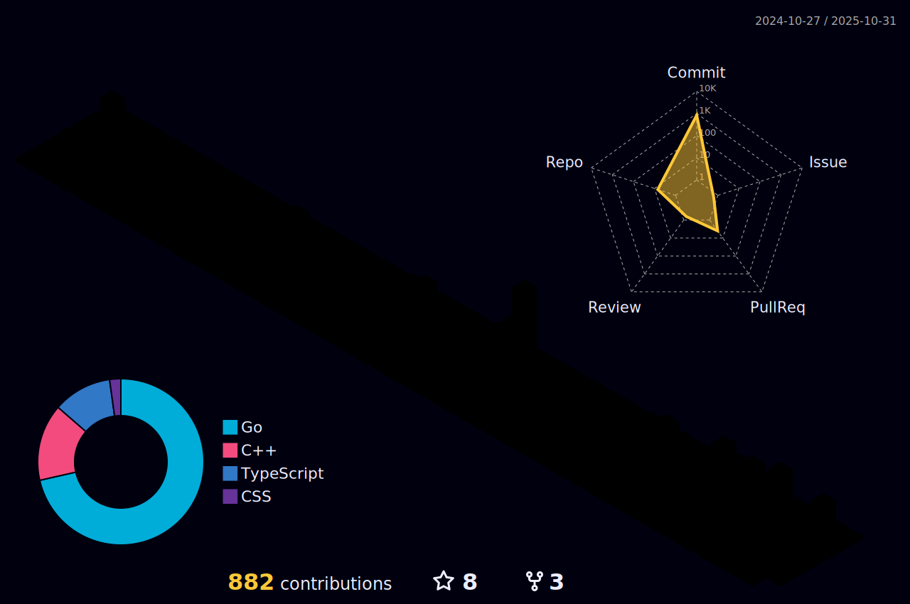

## 💫 Hi there, I'm Ian

I am a software engineer with a focus on DevOps and Cloud engineering.
I am passionate about designing and developing robust software systems that are
scalable, maintainable, and efficient.

I currently study software engineering at Holberton School and work part-time as a freelancer at Turing.

In my free time, I enjoy listening to music and learning quantum computing.

Learn more about me at https://iandee.me

## Skills and Expertise

**Programming Languages:** Python, Java, JavaScript, C/C++, Go, SQL, MATLAB

**Cloud:** AWS, GCP, Azure

**Frameworks and other:** Docker, Kubernetes, Vagrant, HTML, CSS, Git, Ansible, CircleCI, Jenkins, CloudFormation, Flask, Nginx, Apache, HAProxy

## 📊 GitHub Stats

